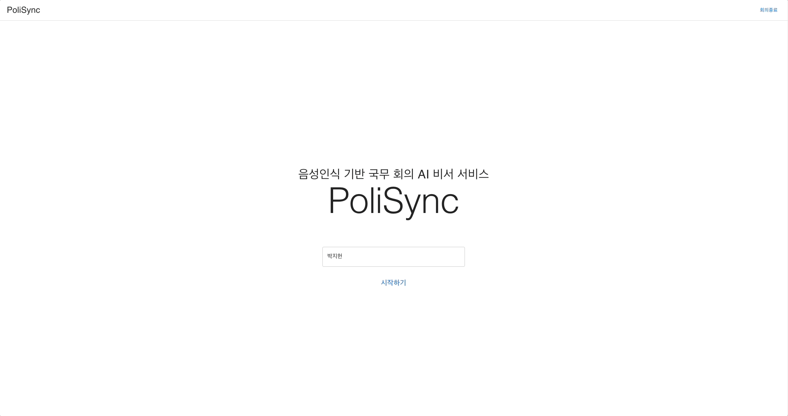
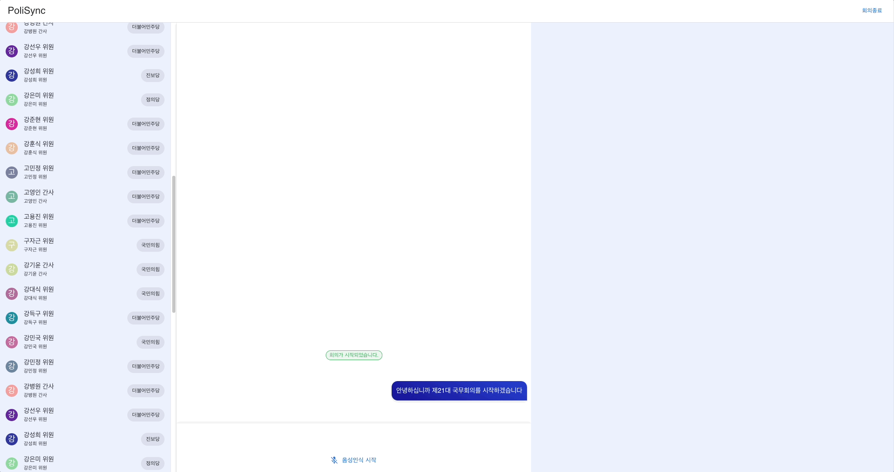
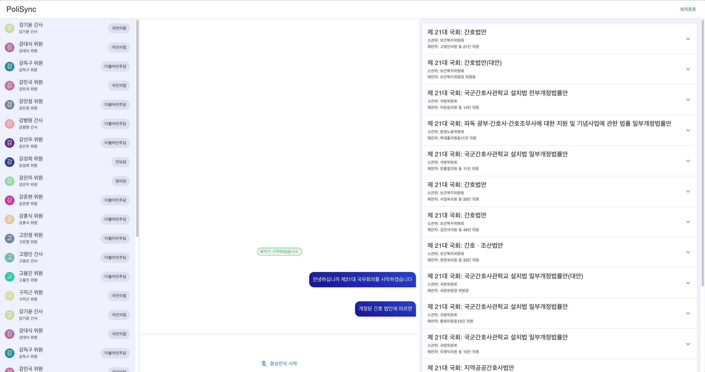

# PoliSync - client

> PoliSync is a voice recognition-based the minutes of a meeting writing platform using National Assembly Public Data & API and Generative AI (Open AI).

### [Client Repo](https://github.com/jiheon788/polisync-client)&nbsp;&nbsp;&nbsp;&nbsp;&nbsp;[Server Repo](https://github.com/jiheon788/polisync-server)

## Features

- Creating the minutes of a meeting
  - Voice-based Live chat using WebSocket & Web Speech API
  - User classification using querystring (no-database)
- Searching References based on voice recognition & Member of the National Assembly (National Assembly data)
  - Infinite Scrolls with IntersectionObserver API
- Meeting Summary (Generative AI with proxy server in the middle)

## Getting Started

#### Install

```
npm install
```

#### Start

```
npm run start
```

#### Env

Check the API on the [Open National Assembly information site (KR)](https://open.assembly.go.kr/portal/openapi/main.do) and Fill out `.env`

```
REACT_APP_SERVER_URL={{server URL}}

REACT_APP_NATIONAL_ASSEMBLY_OPEN_API_URL={{National Assembly Open API URL}}
REACT_APP_NATIONAL_ASSEMBLY_OPEN_API_KEY={{National Assembly Open API key}}
```

## Tech Stack

`React`, `TypeScript`, `@tanstack/react-query`, `Recoil`, `Mui` , `Axios`, `Socket`

## Sample

#### 1. Enter a conference room by entering your name on the main screen: 



#### 2. Press and speak on the voice recognition button at the bottom of the chat section to convert to text: 


#### 3. When words of certain keywords are found, reference documents are found through the data of the National Assembly: 


#### 4. When words of certain keywords are found, reference documents are found through the data of the National Assembly:



