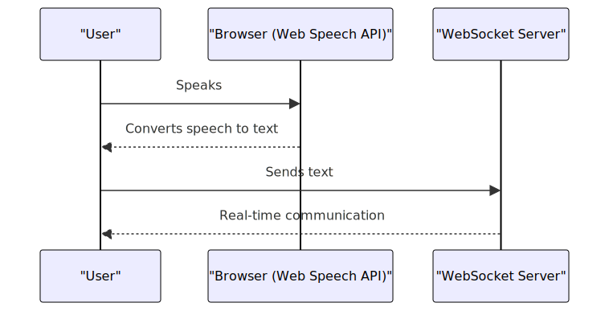
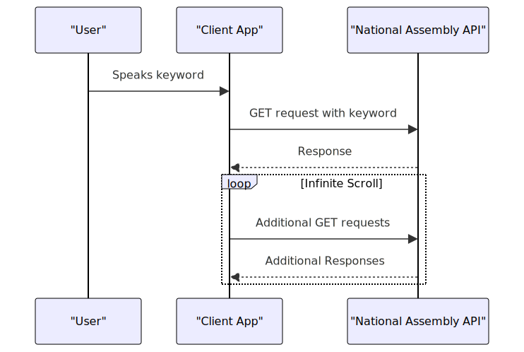
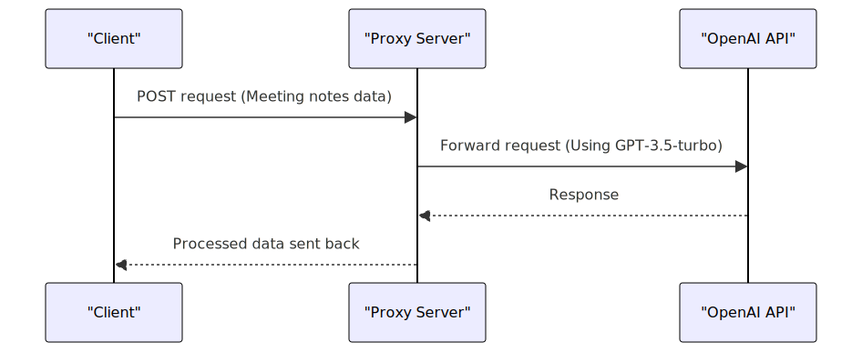

# PoliSync - client

> This repository is for the MVP of PoliSync React app client. 

### [Client Repo](https://github.com/jiheon788/polisync-client)&nbsp;&nbsp;&nbsp;&nbsp;&nbsp;[Server Repo](https://github.com/jiheon788/polisync-server)

PoliSync is a voice recognition-based the minutes of a meeting writing platform using National Assembly Public Data & API and Generative AI (Open AI).


## Getting Started

#### Install

```
npm install
```

#### Start

```
npm run start
```

#### Env

Check the API on the [Open National Assembly information site (KR)](https://open.assembly.go.kr/portal/openapi/main.do) and Fill out `.env`

```
REACT_APP_SERVER_URL={{server URL}}

REACT_APP_NATIONAL_ASSEMBLY_OPEN_API_URL={{National Assembly Open API URL}}
REACT_APP_NATIONAL_ASSEMBLY_OPEN_API_KEY={{National Assembly Open API key}}
```

## Features

- Creating the minutes of a meeting
  - Voice-based Live chat using [WebSocket](https://developer.mozilla.org/ko/docs/Web/API/WebSocket) & [Web Speech API](https://developer.mozilla.org/en-US/docs/Web/API/Web_Speech_API)
  - User classification using querystring (no-database)
- Searching References based on voice recognition & Member of the National Assembly ([National Assembly data](https://open.assembly.go.kr/portal/openapi/main.do))
  - Infinite Scrolls with [IntersectionObserver API](https://developer.mozilla.org/ko/docs/Web/API/IntersectionObserver)
- Meeting Summary using [OpenAI API (Generative AI)](https://openai.com/blog/openai-api) with proxy server in the middle

## Tech Stack

`React`, `TypeScript`, `@tanstack/react-query`, `Recoil`, `Mui` , `Axios`, `webSocket`

## Service Architecture




- The React App Client sends and receives requests to Node.js/Express Server and the National Assembly API.
- Node.js/Express Server acts as a proxy server for OpenAI, and at the same time acts as a WebSocket server.
- The external APIs OpenAI and National Assembly APIs send responses to servers and clients, respectively.

## How it Works
The following is a sequence diagram of the key features.

### Creating the minutes of a meeting (Voice-based Live chat)



1. When the user says, **Browser (Web Speech API)** converts it into text.
2. Client sends the converted text to the WebSocket Server.
3. WebSocket Server exchanges data with users through real-time communication.

### Searching References



1. User refers to a specific keyword
2. The Client App recognizes this keyword, extracts it, and sends a GET request to the National Assembly API.
3. The National Assembly API sends a response, and users can check this information.
4. Infinite scrolling allows the Client App to send additional GET requests, while the National Assembly API sends additional responses.


### Generating meeting summary



1. Client sends a POST request to the Proxy Server with the meeting notes data.
2. The Proxy Server forwards this request to the OpenAI API, using the GPT-3.5-turbo model.
3. The response from the OpenAI API is received by the Proxy Server, which then processes and sends the data back to the Client.

> Reasons for using the proxy server: Use a proxy server for enhanced security. The proxy server acts as a middleman between the client and the OpenAI API.


## Demo of this project

#### 1. Enter a conference room by entering your name on the main screen: 


#### 2. Press and speak on the voice recognition button at the bottom of the chat section to convert to text: 


#### 3. When words of certain keywords are found, reference documents are found through the data of the National Assembly: 


#### 4. When words of certain keywords are found, reference documents are found through the data of the National Assembly:


